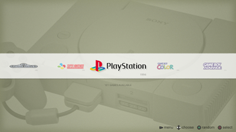

EmulationStation Theme - pg-breath 0.1
======================================

Intro
-----

A clean and minimalistic theme for EmulationStation to be used in large screens.
I would say that 42" is the minimum. It's not 100% finished but you can try it.
Take into consideration that system names are a bit different from other themes
around.

  - gba-crt - Game Boy Advance (cartridges)
  - gbc - Game Boy Color
  - gbo - Game Boy
  - lnx - Atari Lynx
  - mdr-crt - Megadrive/Genesis (cartridges)
  - nes-crt - NES (cartridges)
  - ps1 - Playstation (1)
  - sgg - Sega Game Gear
  - sms - Sega Master System
  - snt-crt - Super Nintendo (cartridges)

Screenshots
-----------

You can find the images at full resolution in `screenshots` dir.

Credits
-------

  - Control icons: [Xelu FREE keyboard & controller prompts pack](https://thoseawesomeguys.com/prompts/)
  - Font: [Roboto](https://fonts.google.com/specimen/Roboto?selection.family=Roboto)
  - Sounds: [Created by David McKee (ViRiX) soundcloud.com/virix](https://opengameart.org/content/ui-sound-effects-pack)

https://opengameart.org/content/zippo-click-sound
https://opengameart.org/content/menu-rollover
https://opengameart.org/content/click-ui-menu-sfx-yesnoselect
